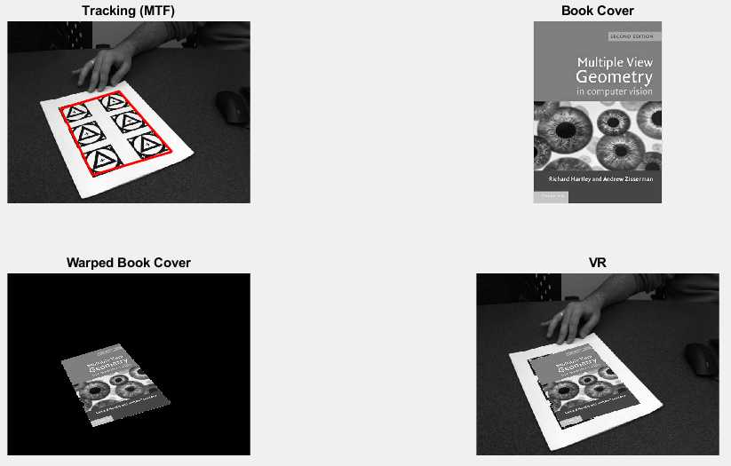

# Homography_Tools
**A simple tool to calculate homography and using it for a simple VR application**
 
[Disclaimer] This was developed while working on the CMPUT 615 course in my doctoral studies. 

### Example of The Homography Calculator in Regular Mode

### Example of The Homography Calculator in Normalization Mode

### Example of the VR Results

### Datasets
The datasets for the VR code can be found at: [Here](https://bit.ly/2uNzymL)
